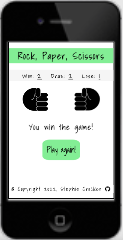
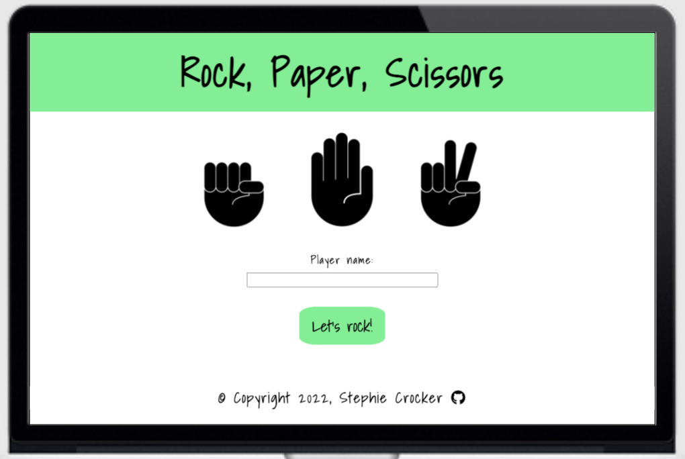

Rock, Paper, Scissors - An Interactive online Game
==================================

* * *

ABOUT THE WEBSITE:
------------------

* * * 

[Link to deployed site](https://stephaniecrocker91.github.io/rock-paper-scissors/)

_Rock, Paper, Scissors_ is an online game of the classic Rock, Paper, Scissors. The computer will generate its random choices and your job is to simply beat that big mean machine in a series of 5 rounds! Let's rock!

* * * 

## TARGET AUDIENCE:

* * *

This online interactive game targets all ages 5+, and that is its beauty! Almost anyone can appreciate a good game of rock, paper, scissors.

*   Children 5+
*   Adults

  

USER STORIES:
-------------

* * *

1. The site is designed in a way that makes the game fun and easy to play.
2. The game feels personal as the user can input their name and see it displayed throughout.
3. The game rounds and scores are displayed throughout. 
4. The user will want to play again and again!

* * * 

STRAGETY:
---------

* * *

Create a fun and easy to navigate interactive game of Rock, Paper & Scissors that allows the player to play against the computer who will generate its choice at random. 
The game will last 5 rounds, displaying the tally throughout. After Round 5 the game will display the Game Winner, and allow for the option to _Play Again_.

The site aesthetic is minimalistic: displays big buttons and bold images of the player and computer choice. It is styled with bright and contrasting colors.
Consistent styling for easy navigation using a mobile-first approach and then ensuring it displays flawlessly across all devices. Create a code that is clear and allows to update with ease.

* * * 

STRUCTURE:
----------

* * *

### Header & Footer

* * *

#### _Header - Game Title_

*   The header displaying the game title is clearly displayed at the top of the HTML page.
*   It is styled in CSS with fun font-family and in bright and contrasting colors which set the mood to the game.

* * * 

### Initial Home page - _launch game modal_

* * *

The initial homepage consists of:

* The header, containing the name of the game: Rock, Paper, Scissors. It is clearly displayed at the top of the page in bright, large, fun contrasting styling.
* An image of three hand symbols representing rock, paper and scissors. They are minimalistic and complementory to the page's fun, bold, simplistic styling.
* A small form where the Player will be required to submit their name. The form will not submit without this information. The submit button is styled in the same colors as the header and it reads "Let's rock!".

* * * 
  
### Playing first round- _play round 1 display_

* * *

When clicking "let's rock!" in the initial form, you are taken to the initial play round modal. This displays:

* A short subtitle displaying Round number 1. This allows the user to immediately recognise there will be a set number of rounds and will make the game progress easy to track. 
* Rock, Paper and Scissors interactive buttons. These are styled in the same bright bold colors, fun font, and are displayed clearly in the centre of the page.

 

### After initial Rock, paper, scissors selection - _play round 2 to round 5 display_

* * *

After the user selecting their first choice of Rock, Paper or Scissors, they are lead to the next modal (play-round-2 modal). There are only a couple of additions to this display:

*   The same subtitle displaying Round Number: x. The round has been updated using Javascript. It will increment +1 each time, until reaching Round 5.
*   The selection buttons for the next round remain displayed below for game continuity.
*   A div clearly displaying the Game tally of win, lose, and draw. The score is underlined.
*   A visual representation of the User and Computer's selection. This is divided into:
    * User and computer image of their selection (rock, paper, or scissors). They are centred and facing each other as they would in real life.
    * A label underneath each image. The User's player label displays the Name that has been input into the form. The computers label simply displays _Computer:_
*   A div containing the previous rounds result: An short alert message displaying previous round result: You win!, You lose!, or You draw!

  
* * * 

### Game Over Modal: displayed after Round 5 - _game over display_

* * *

After the user has selected their final choice in Round 5, they are redirected to the Game Over Modal. This displays:

* A div clearly displaying the Game tally of win, lose, and draw. The score is underlined.
* The initial two rock symbols facing each other (as on round 1).
* Final Alert message displaying the game result: You win! You lose! You draw! 
* A Refresh button to restart the game. It is styled in the same way as the previous buttons. Clicking this button will trigger a function resetting the game back to _launch-game-modal_

## SKELETON:

-----------

### WIREFRAMES:
* I began designing from a mobile display. I wanted the site to look very minimalistic, with big bright buttons and visual representations of rock, paper, scissors. 

* For the wide screen display, I wanted a very similar layout, but a bit more widespread. 

As seen above, I initially wanted the header Rock paper Scissors displayed throughout the entire game. I decided to rmeove it from the game rounds, as I wanted to make sure that the user would NEVER have to scroll down for their result. Removing the header allowed me to maintain the font and buttons large enough and user friendly.

* * * 

## SURFACE:

* * *

Before starting, I created the wireframes displayed above. I knew I wanted the game to be minimalistic, fun, and bright. 

### Colors

* * *

For the purpose of this game, I wanted to choose very block, bright, almost cartoon-like colors that would work well together.
I came up with the following palette:

* * * 

### Typography

* * *

Shadows into Light: I wanted to use a playful font that would go nicely with the game. It is fun, relaxed, cartoon-like, and it has some personality! My fall-back font is Sans, which I think also goes nicely with the site's feel and purpose.
I initially wanted to combine it with another font, but once I started styling, I preferred keeping it the one.

### Images and Icons

* * *

*   Sticking to my cartoon-like inspiration for this game, I chose incredibly minimalistic icons for the Rock, paper, and scissors. These images almost feel like emojis, they are modern and fun. 
*   I also chose to keep the palette simple with black and white. It is bold and the user is instantly drawn to them.

* * * 

FEATURES:
---------

* * *

### Current features

*   Launch Game Page: This is the page that initially loads when you first arrive to the site. 
    * Header: "Rock, Paper, Scissors"
    * Image of rock, paper and scissors
    * Player name input form (required)
    * Submit button labelled "Let's Rock!"

   

*   Play Round Modal: which loads once the user has submitted the form. The form takes the players name and uses it below.
    * Round number
    * 3 clickable buttons labelled: Rock, Paper and Scissors.
    * A tally of the score to show the user what will be counted for: _Win:0, Draw:0, Lose:0_
    * 2 ROCK images facing each other

  

*   As from Round 2... same as above, plus...
    * The round number will update itself each round!
    * A tally of the current score (which will update round after round): For example: _Win: 0 Draw: 1 Lose: 2_
    * A black box with the outcome of the previous play: For example: _You Draw!_

  

* After the final Round 5...
    * The final score tally.
    * The initial two rock symbols facing each other (as on round 1).
    * The final game result. For example: _Congratulations, you win!_
    * A Refresh button, to play again! (This takes the user back to the start)

 

* * * 

### Future features

* I would love to include some animation with the hand images such as: visual clash of computer and user hands as one beats the other.
* I would like to change the layout so that the selection buttons, start game button and play again button are all in the exact same place on the page display. I think this would allow for an easier flow of the game.
* Ideally I would like to always have the Header displaying game title on top. This was my initial plan, but considering my deadline and having prioritised the javascript side of this project, I decided it was more important for me to remove any need for the user to scroll down. Removing the header in these Round sections was the easiest way to achieve this.

* * * 

## LANGUAGES:

* * *

*   HTML5
*   CSS
*   Javascript

* * * 

## OTHER TECHNOLOGIES, FRAMEWORKS & LIBRARIES:

* * *

*   [Google Fonts](https://fonts.google.com/)
*   [GitHub](https://github.com/)
*   [GitPod](https://www.gitpod.io/)
*   [Coolors](https://coolors.co/)
*   [Pexels](https://www.pexels.com/)
*   [Stack Overflow](https://stackoverflow.com/)
*   [Code beautify](https://codebeautify.org/html-to-markdown)
*   [Compress Jpeg](https://compressjpeg.com/)
*   [Font Awesome](https://fontawesome.com/)
*   [Favicon](https://favicon.io/)

* * * 

## TESTING, BUGS & FIXES:

* * *

For testing I used the following sources:

* * * 

### Tests

* * *

#### [HTML Validator](https://validator.w3.org/)

Tested and no errors found.
Warnings:
* The empty headers are for spaced that will be filled out using Javascript code
* The section area warning suggesting a h2-h6 element: I don't think the form needs a header as it is pretty self explanatory.

#### [CSS Validator- Jigsaw](https://jigsaw.w3.org/css-validator/)
Tested and no errors found.

#### [JAVASCRIPT Validator- JSHint](https://jshint.com/)
Tested and a few errors were found.

Most of these were due to having not put "let" before. Once these bugs were fixed...

The remaining bug is simply due to the function not being called on js page, however it is used in the HTML code.

During this testing I did notice a big problem with the end result! This is explained in the BUGS & FIXES SECTION further below. 

#### Manual testing 

* * * 

* Initial page loads properly.
* Player name form is loaded properly and the text input is required to submit the form and play the game. 
* handlePlayerName() function works correctly, and takes the player name placing it under the players Rock,Paper,Scissors image on display during the rounds.
* All images load properly and are fully visible to the user.
* Nav bar is always visible and footer is fixed always displayed at the bottom of the screen and fully visible.
* The site has responsive design, allowing the website and its features to be fully displayed (visible) on all display sized: phone, tablets, laptops, larger screens.

#### Responsive design:
##### Phone Display
* I took a mobile first design approach, so the website runs very smoothly from a mobile screen. 
* The header bar is fully visible and remains at the top and footer is fixed at the bottom, large enough to view and click into the Github icon yet not distracting from its content. For continuity, they remain this way during the entire game.
* The initial home screen is welcoming, displaying the Rock, Paper, scissors image upon loading and its form.
* The initial form is of an appropriate size, and easily clickable to input the field text and click the submit button.
* During the 5 game rounds the following features remained displayed in the same position: Round number, selection buttons, score tally, user-image and computer-image hands, and the round result.

* * * 

##### Tablet Display 
* The tablet displays nicely on stages of the game.
* The buttons have spread out further across the width of the display, and the sizes have been increased.
* The image sizes have also been slightly increased.
* Font size has been increased also.

* * * 

##### Laptop & larger screens Display 
* The laptop also displays nicely on all pages. 
* The button sizes are larger again.
* Font size has been increased also.
* The Score area and final result areas have been placed in a narrower div that is aligned with the button width.

* * * 

###### BUGS & FIXES: 
* The gameOver function was getting quite heavy and becoming problematic particularly in displaying block and none. A tutor at code institute recommended I  use the an onload instead. This made things run much smoothly.

* While validating my JS for bugs, I encountered a BIG problem regarding my end result. I thought I had tested it enough, but noticed that once in a while the final result displayed would be incorrect! See below:

What was happening was that the result for Round 4 was being read to come up with the final answer. Upon getting assistance from the Code Institute mentors, we discovered that there the easiest option would be to switch the order of the functions run within the playRound(e) function. We would instead place updateRound() at the ends of the function. This fixed the issue.

* I noticed that during the Game rounds, the user was having to scroll down to see their result. For this reason, I decided to remove the header (Rock paper Scissors title) from the display (between rounds 1 and 5). I initially tried to change the font and button sizes, but I thought it all looked a bit too crowded. Due to deadlines, removing the header seemed to be the best way to solve this problem (for now.. I will be working on this in the future)!

#### Lighthouse testing 

* * * 

When putting the site through lighthouse testing, I received the following report.

##### Mobile Lighthouse testing 

##### Desktop Lighthouse testing 

#### Testing User Stories 

* * * 

1. The site is designed in a way that makes the game fun and easy to play.

YES! The styling of the site is simplistic and fun. The buttons and big and bright, and are styled when being hovered over. The page displays images of rock, paper and scissors when called upon. The images are big and bold. The rounds are clearly labelled and the results clearly displayed. It is easy for the user to Refresh the game and play again and again!

 

 

2. The game feels personal as the user can input their name and see it displayed throughout.

YES! The player is able to input their name into an initial form. This is required to play the game. That name is then displayed at the bottom of the user's selection. the use of this tool makes the game personal!

 

3. The game rounds and scores are displayed throughout. 

YES! Both are displayed clearly throughout the rounds.

4. The user will want to come back for more!

This game is fun, easy to play and can be easily replayed after 5 rounds. Its styling is simplistic and fun which will leave the player wanting to come back!

## DEPLOYMENT:

### GitHub Page

This site was deployed to Github pages using the following steps:

1. Go to the Github repository
2. Clock on the Settings tab
3. Go to Github Pages Section
4. From the source dropdown menu select Main branch
5. Once this has been selected, provide the link to the completed website

[Link to deployed site](https://stephaniecrocker91.github.io/rock-paper-scissors/)

* * *

### Forking The GitHub Repository

* * *
You can Fork the Repository. This makes a copy of the original repository on our Github account so you can make changes without affecting the original repository.
1. Log into GitHub and locate the GitHub repository you want.
2. Click on the "Fork" button which is located in the top right corner.
3. You will now have a copy of the original repository in your GitHub account.

* * * 

### Cloning the Project.
* * *
1. Log into GitHub and locate the GitHub repository you want.
2. Under the repository name, click "Code" button which will come up with a dropdown menu.
3. Where it says Clone, copy the link below.

* * * 

CREDITS: 
--------

* * *

### Content & Code
* A couple of the code institute tutors helped me with some issues I was having. 
    * My gameOver function was getting quite heavy and becoming problematic particularly in displaying block and none. A tutor at code institute recommended I  use the an onload instead. This made things run much smoothly. [Page Onload](https://www.w3schools.com/jsref/event_onload.asp).
    * When I encountered the end result bug, I had help from Oisin at Code Institute. He suggested I try to solve it by changing the order of my functions  within the playRound(e) function. We would instead place updateRound() at the ends of the function. This fixed the issue.

* Images & Icons:
    * [Font Awesome](https://fontawesome.com/) for [GitHub Icon](https://fontawesome.com/v5.15/icons/github?style=brands)
    * [Vector Stock](https://www.vectorstock.com/royalty-free-vector/rock-paper-scissors-hand-gesture-vector-25169733) for Rock, Paper, Scissors hand images.
    * [Favicon](https://favicon.io/emoji-favicons/oncoming-fist)
       

